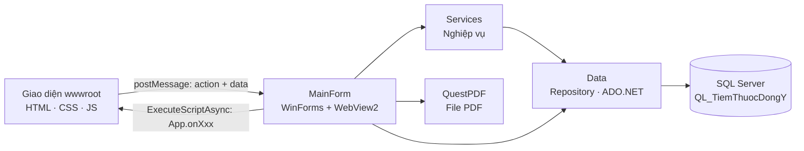

# 🌿 Traditional Herbal Pharmacy – Quản lý tiệm thuốc Đông y

Ứng dụng desktop quản lý tiệm thuốc Đông y: danh mục vị thuốc, khách hàng, kê đơn thuốc thang, nhập kho từ nhà cung cấp, thu chi công nợ và báo cáo doanh thu. Phần lõi viết bằng C# WinForms, giao diện là trang HTML/CSS/JavaScript chạy bên trong WebView2, dữ liệu lưu trên SQL Server.

_A desktop management app for a traditional herbal medicine shop, built with C# WinForms + WebView2 and SQL Server._


## Tính năng

- **Tổng quan**: doanh thu hôm nay, số đơn thuốc còn nợ, số vị thuốc sắp hết (tồn kho ≤ mức tồn tối thiểu) và các hoạt động gần đây; xuất báo cáo tổng quan ra PDF.
- **Thuốc Đông y**: thêm, sửa, xóa, tìm kiếm vị thuốc với tên khác, đơn vị tính, giá bán lẻ, tồn kho, tồn tối thiểu, công dụng và chống chỉ định. Mã thuốc tự sinh (`T001`, `T002`…), xóa là xóa mềm (ẩn khỏi danh sách).
- **Khách hàng**: thêm, sửa, xóa, tìm theo tên hoặc số điện thoại; mã khách tự sinh (`KH001`…). Khách đã có đơn thuốc thì không xóa được.
- **Đơn thuốc**: lập đơn gồm bác sĩ kê đơn, chẩn đoán và các vị thuốc theo liều (gram) × số thang; sửa, xóa, lọc theo ngày, khách hàng, số đơn; in đơn ra PDF. Thu tiền nhiều lần bằng tiền mặt hoặc chuyển khoản, mỗi lần tạo một phiếu thu.
- **Nhập kho**: tạo phiếu nhập từ nhà cung cấp (gõ tên nhà cung cấp chưa có thì được hỏi để thêm nhanh ngay trong form), tồn kho tăng khi lưu phiếu; thanh toán cho nhà cung cấp theo từng đợt; lọc theo ngày, nhà cung cấp, số phiếu; in phiếu nhập ra PDF.
- **Báo cáo**: chọn tháng để xem doanh thu so với tháng trước, chi phí nhập kho, doanh thu 7 ngày gần nhất, top 10 vị thuốc bán chạy, công nợ phải thu khách hàng và phải trả nhà cung cấp; xuất báo cáo tổng hợp, báo cáo kho và báo cáo công nợ ra PDF.
- **Tài khoản**: đăng nhập và phân quyền theo vai trò; quên mật khẩu bằng mã 6 số gửi qua email (hiệu lực 10 phút); Admin thêm, sửa, đổi vai trò, đặt mật khẩu mới, khóa/mở khóa và xóa tài khoản.

Các file PDF được lưu vào thư mục Documents của người dùng và tự mở bằng trình xem PDF mặc định của Windows.

## Công nghệ

- C#, .NET 8 (WinForms) cho ứng dụng; .NET Framework 4.7.2 cho các thư viện Domain, Data, Services
- Microsoft Edge WebView2 để hiển thị giao diện web trong cửa sổ WinForms
- HTML, CSS, JavaScript, jQuery 3.6, Material Icons
- SQL Server, truy vấn bằng ADO.NET (`System.Data.SqlClient`)
- QuestPDF (giấy phép Community) để tạo file PDF
- SMTP (`System.Net.Mail`) để gửi mã đặt lại mật khẩu

## Yêu cầu

- Windows 10 hoặc 11
- Visual Studio 2022 với workload **.NET desktop development** (có .NET 8 SDK). Nếu máy chưa có, cài thêm **.NET Framework 4.7.2 targeting pack** trong mục *Individual components* của Visual Studio Installer.
- SQL Server 2019 trở lên (bản Express là đủ) và SQL Server Management Studio (SSMS)
- Microsoft Edge WebView2 Runtime (Windows 11 có sẵn; Windows 10 có thể tải từ trang của Microsoft)
- Kết nối Internet khi chạy, vì giao diện tải jQuery và Material Icons qua CDN

## Cài đặt và chạy

### 1. Lấy mã nguồn

```bash
git clone https://github.com/NguyenKhoa12/Traditional-Herbal-Pharmacy.git
cd Traditional-Herbal-Pharmacy
```

### 2. Tạo cơ sở dữ liệu

Mở `final.sql` bằng SSMS và chạy toàn bộ script (F5). Script sẽ tạo database `QL_TiemThuocDongY` kèm dữ liệu mẫu.

> [!WARNING]
> Script **xóa database `QL_TiemThuocDongY` nếu đã tồn tại** rồi tạo lại từ đầu. Hãy sao lưu trước nếu bạn đang có dữ liệu thật.

Hoặc chạy bằng dòng lệnh:

```powershell
sqlcmd -S localhost\SQLEXPRESS -E -i final.sql
```

### 3. Cấu hình chuỗi kết nối

Chuỗi kết nối nằm trong `TiemThuocDongY.WinApp/Program.cs`:

```csharp
Db.ConnectionString = "Server=localhost\\SQLEXPRESS;Database=QL_TiemThuocDongY;Trusted_Connection=True;TrustServerCertificate=True;";
```

Sửa phần `Server=` cho đúng instance SQL Server trên máy (xem ở ô *Server name* khi đăng nhập SSMS):

- Instance mặc định: `Server=localhost;` hoặc `Server=.;`
- Đăng nhập bằng tài khoản SQL thay vì Windows: thay `Trusted_Connection=True;` bằng `User Id=sa;Password=<mật khẩu>;`

### 4. Cấu hình email (tùy chọn)

Chức năng quên mật khẩu gửi mã qua Gmail SMTP. Thông tin gửi mail được khai báo trong hàm khởi tạo của `TiemThuocDongY.WinApp/MainForm.cs`:

```csharp
var emailSettings = new EmailSettings
{
    SmtpHost = "smtp.gmail.com",
    SmtpPort = 587,
    EnableSsl = true,
    UserName = "email-cua-ban@gmail.com",
    Password = "mat-khau-ung-dung",   // App Password của Google, không phải mật khẩu đăng nhập
    FromAddress = "email-cua-ban@gmail.com",
    FromDisplayName = "Tiệm Thuốc Đông Y"
};
```

App Password chỉ tạo được khi tài khoản Google đã bật xác minh 2 bước. Nếu thông tin SMTP sai, chức năng quên mật khẩu sẽ báo không gửi được email; các chức năng khác vẫn hoạt động bình thường.

> [!CAUTION]
> Không commit mật khẩu ứng dụng thật lên GitHub.

### 5. Chạy ứng dụng

1. Mở `TiemThuocDongY.sln` bằng Visual Studio 2022.
2. Chuột phải vào project `TiemThuocDongY.WinApp` → **Set as Startup Project**.
3. Nhấn **F5**. Visual Studio sẽ tự khôi phục các gói NuGet ở lần build đầu tiên.

## Tài khoản mẫu

| Tên đăng nhập | Mật khẩu | Vai trò |
|---|---|---|
| `admin` | `123` | Admin |
| `thungan` | `123` | Thu ngân |
| `bs_yhct` | `123456` | Bán thuốc |

Menu hiển thị theo vai trò:

| Vai trò | Màn hình được dùng |
|---|---|
| Admin | Tất cả màn hình, gồm quản lý tài khoản; là vai trò duy nhất được nhập giảm giá khi lập đơn |
| Thu ngân | Đơn thuốc, Nhập kho |
| Bán thuốc | Thuốc Đông y, Khách hàng, Đơn thuốc (không có nút thu tiền) |

Mọi vai trò đều xem được trang thông tin tài khoản của mình.

## Quy trình nghiệp vụ chính

- **Đơn thuốc** được tạo ở trạng thái *Nháp*. Khi chuyển sang *Đã kê đơn*, hệ thống cộng tổng `liều (gram) × số thang` của từng vị, kiểm tra tồn kho rồi trừ kho trong cùng một transaction; nếu có vị không đủ hàng thì báo lỗi và không trừ vị nào.
- **Thanh toán đơn** tự cập nhật trạng thái *Chưa thanh toán*, *Trả một phần*, *Đã thanh toán* hoặc *Không thu*. Hạn thanh toán mặc định là 15 ngày kể từ ngày lập. Đơn đã có phiếu thu thì không xóa được.
- **Phiếu nhập** cộng tồn kho ngay khi lưu; mỗi lần trả tiền cho nhà cung cấp tạo một phiếu chi. Hạn thanh toán mặc định là 15 ngày kể từ ngày nhập.
- **Mã chứng từ** tự sinh: đơn thuốc `DT0001`, phiếu nhập `PN0001`, phiếu thu `PT0001`.

## Kiến trúc

Solution gồm 4 project chia theo lớp:

| Project | Nền tảng | Vai trò |
|---|---|---|
| `TiemThuocDongY.Domain` | .NET Framework 4.7.2 | Entity và DTO |
| `TiemThuocDongY.Data` | .NET Framework 4.7.2 | Repository truy vấn SQL Server bằng ADO.NET |
| `TiemThuocDongY.Services` | .NET Framework 4.7.2 | Nghiệp vụ: đăng nhập, đặt lại mật khẩu, gửi email, đơn thuốc, tổng quan, báo cáo |
| `TiemThuocDongY.WinApp` | .NET 8 (WinForms) | Cửa sổ chính chứa WebView2, nhận lệnh từ giao diện và xuất PDF |

Giao diện và C# trao đổi với nhau qua message của WebView2:



1. JavaScript gửi `{ action, data }` bằng `window.chrome.webview.postMessage(...)`.
2. `MainForm.WebView2_WebMessageReceived` đọc `action` rồi gọi service hoặc repository tương ứng.
3. Kết quả được trả về giao diện bằng cách gọi hàm `App.onXxx(...)` trong `app.js` qua `ExecuteScriptAsync`.

Muốn thêm một chức năng: thêm `case` cho action mới trong `MainForm.cs`, viết phần xử lý ở Services/Data, rồi thêm hàm callback `App.onXxx` tương ứng trong `wwwroot/js/app.js`.

Khi chỉ cần chỉnh giao diện, có thể mở thẳng `wwwroot/index.html` bằng trình duyệt: nút đăng nhập sẽ vào bằng tài khoản demo nhưng không có dữ liệu từ CSDL.

## Cơ sở dữ liệu

Script `final.sql` tạo 12 bảng, 2 view và dữ liệu mẫu (10 vị thuốc, 5 khách hàng, 3 nhà cung cấp, 7 đơn thuốc, 2 phiếu nhập).

| Nhóm | Bảng / View |
|---|---|
| Danh mục | `DM_Thuoc`, `DM_KhachHang`, `DM_NhaCungCap` |
| Bán hàng | `DonThuoc`, `DonThuocChiTiet`, `PhieuThu` |
| Nhập hàng | `PhieuNhap`, `PhieuNhapChiTiet`, `PhieuChi` |
| Hệ thống | `Sys_User`, `Sys_Role`, `Sys_PasswordReset` |
| Công nợ (view) | `v_CongNoKhachHang`, `v_CongNoNhaCungCap` |

Các cột `TienKhachPhaiTra`, `TienPhaiTra` và `ConNo` là cột tính toán (computed column): SQL Server tự tính từ tổng tiền hàng, giảm giá và số tiền đã thanh toán.

## Cấu trúc thư mục

```
Traditional-Herbal-Pharmacy/
├── TiemThuocDongY.sln
├── final.sql                       # Script tạo CSDL + dữ liệu mẫu
├── TiemThuocDongY.Domain/
│   └── Entities/                   # Entity và DTO
├── TiemThuocDongY.Data/
│   ├── Infrastructure/Db.cs        # Giữ chuỗi kết nối, tạo SqlConnection
│   └── Repositories/               # Thuốc, khách hàng, đơn thuốc, phiếu nhập, báo cáo, tài khoản...
├── TiemThuocDongY.Services/
│   ├── Auth/                       # Đăng nhập, quên mật khẩu, quản lý tài khoản
│   ├── Email/                      # Gửi email qua SMTP
│   ├── ThuocSvc/                   # Nghiệp vụ thuốc
│   ├── DonThuocService.cs
│   ├── DashboardService.cs
│   └── BaoCaoService.cs
└── TiemThuocDongY.WinApp/
    ├── Program.cs                  # Điểm khởi động, chuỗi kết nối
    ├── MainForm.cs                 # Host WebView2, xử lý message từ giao diện
    ├── Printing/                   # Mẫu PDF: đơn thuốc, phiếu nhập, các báo cáo
    └── wwwroot/                    # Giao diện: index.html, js/app.js, css/site.css
```

## Hướng phát triển

- Băm mật khẩu trước khi lưu (hiện `Sys_User.PasswordHash` đang lưu mật khẩu dạng văn bản thường).
- Đưa chuỗi kết nối và cấu hình SMTP ra file cấu hình hoặc biến môi trường thay vì ghi trực tiếp trong code.
- Kiểm tra quyền ở cả phía C#; hiện việc phân quyền mới được thực hiện trên giao diện.
- Đóng gói jQuery và Material Icons cùng ứng dụng để chạy được khi không có mạng.
